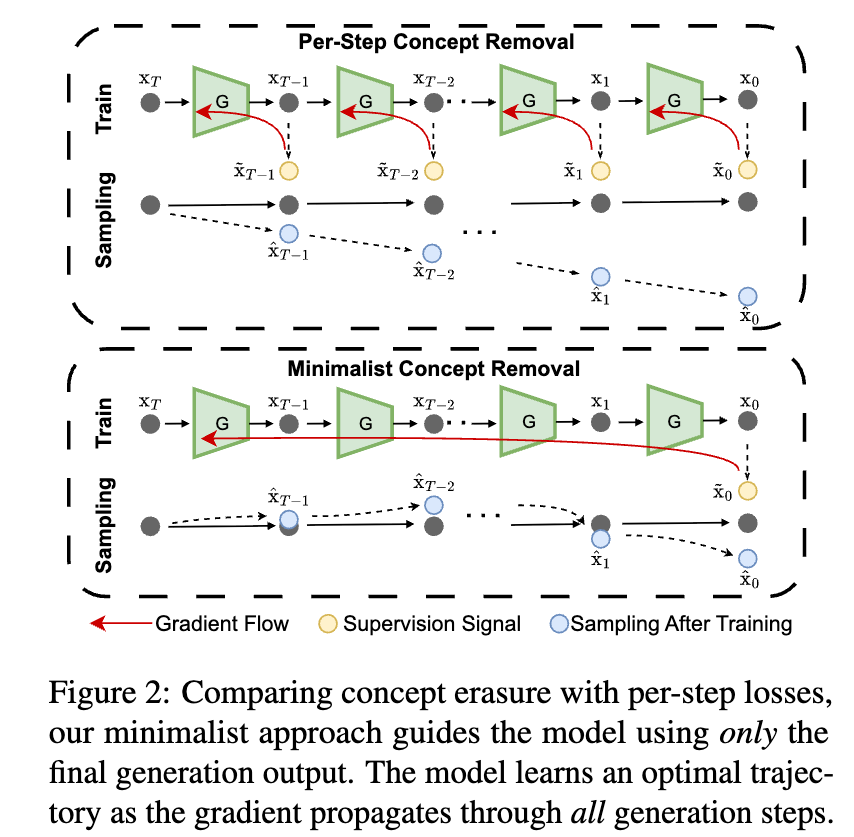

# Minimalist Concept Erasure in Generative Models

<div align="center">

[](https://icml.cc/virtual/2025)
[](https://arxiv.org/abs/2507.13386)
[](https://openreview.net/forum?id=oBCw6PZ0fX)

<!-- [](https://your-project-page.github.io) -->

</div>

> **Authors:** Yang Zhang, Er Jin, Yanfei Dong, Yixuan Wu, Philip Torr, Ashkan Khakzar, Johannes Stegmaier, Kenji Kawaguchi


## 📋 Overview

This repository contains the official implementation of **"Minimalist Concept Erasure in Generative Models"**, a novel approach for removing unwanted concepts from text-to-image diffusion models and flow models through sparse, minimalist weight masking. Our method learns binary masks on attention, feedforward, and normalization layers to selectively erase concepts (e.g., nudity, copyrighted characters, artistic styles) while preserving the model's general capabilities.

### Key Features

- ✅ **Minimal Modification**: Sparse binary masks on specific model components
- ✅ **Multi-Model Support**: Stable Diffusion (1.x, 2.x, XL), FLUX
- ✅ **Flexible Concept Erasure**: Nudity, copyright, artistic styles, IP characters
- ✅ **Memory Efficient**: Denoising-Step-Wise Gradient checkpointing

### Method Overview

<p align="center">
  
</p>

Our approach learns trainable lambda (λ) masks that control which model components to mask during inference:

1. **Training Phase**: Optimize continuous masks using reconstruction loss (preserve general capabilities) and intermediate loss (erase target concepts)
2. **Inference Phase**: Binarize masks to create sparse, efficient modifications
3. **Hook-based Application**: Apply masks via forward hooks on PyTorch modules

The method uses a custom gradient checkpointing scheme to enable memory-efficient training by splitting the diffusion process into preparation and denoising phases.

## 📁 Project Structure

```
.
├── configs/              # YAML configuration files
│   ├── flux.yaml
│   ├── sdxl.yaml
│   └── ...
├── scripts/             # Training and evaluation scripts
│   ├── train.py
│   ├── flux_inference.py
│   ├── hyperparameter_tuning.py
│   └── ...
├── src/diffsolver/      # Main package
│   ├── models/          # Model implementations (Flux, SD, etc.)
│   ├── hooks/           # Masking hooks for layers
│   ├── data/            # Dataset loaders
│   ├── utils/           # Utility functions
│   └── evaluation/      # Evaluation metrics
├── baselines/           # Baseline method implementations
│   ├── esd/            # Erased Stable Diffusion
│   ├── ca/             # Concept Ablation
│   ├── sld/            # Safe Latent Diffusion
│   ├── flowedit/       # FlowEdit
│   └── eap/            # Embedding-based approach
├── tests/              # Unit tests
└── models/             # Pre-trained lambda masks
```

## 🚀 Quick Start

### Installation

```bash
# Clone the repository
git clone https://github.com/YaNgZhAnG-V5/minimalist_concept_erasure
cd minimalist_concept_erasure

# Create virtual environment (optional but recommended)
conda create -n concept_erasure python=3.10
conda activate concept_erasure

# Install dependencies
pip install -e .

# Install optional dependencies
pip install -e ".[core,test]"
```

### Environment Setup

Create a `.env` file in the root directory:

```bash
PYTHON=python
RESULTS_DIR=./results
CONFIG_DIR=./configs
```

<!-- ### Pre-trained Models

Download our pre-trained lambda masks for FLUX:

```bash
# Lambda masks are stored in models/flux/
# - attn.pt: Attention layer masks
# - ff.pt: Feedforward layer masks
# - norm.pt: Normalization layer masks
``` -->

## 🎯 Usage

### Training

#### Basic Training

```bash
# Train on FLUX model for concept erasure
python scripts/train.py --cfg configs/flux.yaml
```

#### Training with Accelerate (Distributed)

```bash
# Single GPU
accelerate launch scripts/train.py --cfg configs/flux.yaml

# Multi-GPU
accelerate launch --multi_gpu scripts/train.py --cfg configs/flux.yaml
```

#### Using Makefile

```bash
# Train with specific config
make accvisual cfg=flux

# Generate hyperparameter sweep configs
make gen

# Run hyperparameter sweep
make run
```

#### Custom Configuration

```bash
# Override config parameters via command line
python scripts/train.py \
  --cfg configs/flux.yaml \
  --cfg-options \
    trainer.epochs=10 \
    trainer.lr=0.1 \
    data.concept="nudity"
```

### Inference

#### Generate Images with Erased Concepts

```bash
python scripts/flux_inference.py \
  --prompt nudity_concept \
  --save_pt models/flux/attn.pt \
  --save_dir ./results/nudity_eval \
  --device 0 \
  --seed 48
```

#### Supported Prompt Datasets

- `nudity_concept`: Nudity-related prompts
- `i2p`: Inappropriate Image Prompts dataset
- `p4d`: Prompts for Debias dataset
- `mma`: Multi-Modal Adversarial dataset
- `ring-a-bell-[threshold]-[length]`: Adversarial prompts (e.g., `ring-a-bell-3-38`)
- `ip`: IP character prompts (requires `--concept [character_name]`)

#### Baseline Methods

```bash
# FlowEdit baseline
python scripts/flux_inference.py \
  --baseline flowedit \
  --prompt nudity_concept \
  --save_dir ./results/flowedit

# SLD (Safe Latent Diffusion) baseline
python scripts/flux_inference.py \
  --baseline sld \
  --prompt nudity_concept \
  --save_dir ./results/sld
```

### Evaluation

#### Detection + CLIP Score + FID

```bash
python scripts/run_detection_clip_fid.py \
  --concept "Hulk" \
  --style ip \
  --save_dir ./results/ip_hulk/ip/flux_unlearn \
  --clip_backbone ViT-L-14 \
  --clip_pretrained datacomp_xl_s13b_b90k \
  --device cuda:0
```

#### NudeNet Detection (for nudity evaluation)

```bash
python scripts/run_nudenet.py \
  --image_dir ./results/nudity_eval/flux_unlearn \
  --output_dir ./results/nudity_scores
```

#### Image Quality Metrics

```bash
python scripts/image_quality_eval.py \
  --original_dir ./results/original \
  --modified_dir ./results/flux_unlearn
```

## 📊 Configuration

Configuration files are located in `configs/`. Key sections:

### Data Configuration

```yaml
data:
  metadata: datasets/gcc3m/Validation_GCC-1.1.0-Validation.tsv
  deconceptmeta: configs/concept_long.yaml
  size: 40
  batch_size: 1
  concept: "nudity"  # Concept to erase
  style: "concept"  # [concept, style, nsfw]
```

### Trainer Configuration

```yaml
trainer:
  model: flux  # [sd1, sd2, sdxl, sd3, flux, dit]
  epochs: 5
  lr: 0.5
  attn_lr: 0     # Set to 0 to disable attention masking
  ff_lr: 0.5     # Feedforward layer learning rate
  n_lr: 0.5      # Normalization layer learning rate
  num_intervention_steps: 5
  init_lambda: 3
  masking: "hard_discrete"  # [sigmoid, hard_discrete, binary]
  precision: 'bf16'  # [fp16, bf16, fp32]
```

<!-- ### Loss Configuration

```yaml
loss:
  reconstruct: 2  # 2 for L2, 1 for L1
  reg: 1
  lambda_reg: true
  reg_alpha: 0.4

trainer:
  beta: 0.1  # Weight for reconstruction loss
``` -->

## 🧪 Testing

```bash
# Run all tests
pytest -s

# Run specific test file
pytest tests/test_hooks.py -s

# Run with coverage
pytest --cov=diffsolver tests/
```

## 🔬 Baselines

<!-- This repository includes implementations of several baseline methods:

| Method | Description | Reference |
|--------|-------------|-----------|
| **ESD** | Erased Stable Diffusion | [Paper Link](#) |
| **CA** | Concept Ablation | [Paper Link](#) |
| **SLD** | Safe Latent Diffusion | [Paper Link](#) |
| **FlowEdit** | Flow-based editing for diffusion models | [Paper Link](#) |
| **EAP** | Embedding-based adversarial purification | [Paper Link](#) | -->

### Running Baselines

```bash
# ESD
cd baselines/esd
python train.py --config prompts.yaml

# CA
cd baselines/ca
python train.py --config prompts.yaml

# EAP (for FLUX)
cd baselines/eap
bash train.sh
```

## 📖 Citation

If you find this work useful, please cite our paper:

```bibtex
@inproceedings{
zhang2025minimalist,
title={Minimalist Concept Erasure in Generative Models},
author={Yang Zhang and Er Jin and Yanfei Dong and Yixuan Wu and Philip Torr and Ashkan Khakzar and Johannes Stegmaier and Kenji Kawaguchi},
booktitle={Forty-second International Conference on Machine Learning},
year={2025},
url={https://openreview.net/forum?id=oBCw6PZ0fX}
}
```

## 🙏 Acknowledgments

- Built on top of [🤗 Diffusers](https://github.com/huggingface/diffusers)
- Uses models from [Stability AI](https://stability.ai/) and [Black Forest Labs](https://blackforestlabs.ai/)
- Evaluation datasets: I2P, P4D, MMA, Ring-a-Bell
- Baseline implementations adapted from their respective papers

## 📧 Contact

For questions or issues, please:
- Open an issue on GitHub
- Contact: [yangzhang@u.nus.edu]

<!-- ## 🔗 Links

- [Paper](https://arxiv.org/abs/0000.00000)
- [Project Page](https://your-project-page.github.io)
- [ICML 2024 Presentation](https://icml.cc/virtual/2024/poster/00000) -->

---

**Note**: This is research code. For production use, additional testing and validation is recommended.
